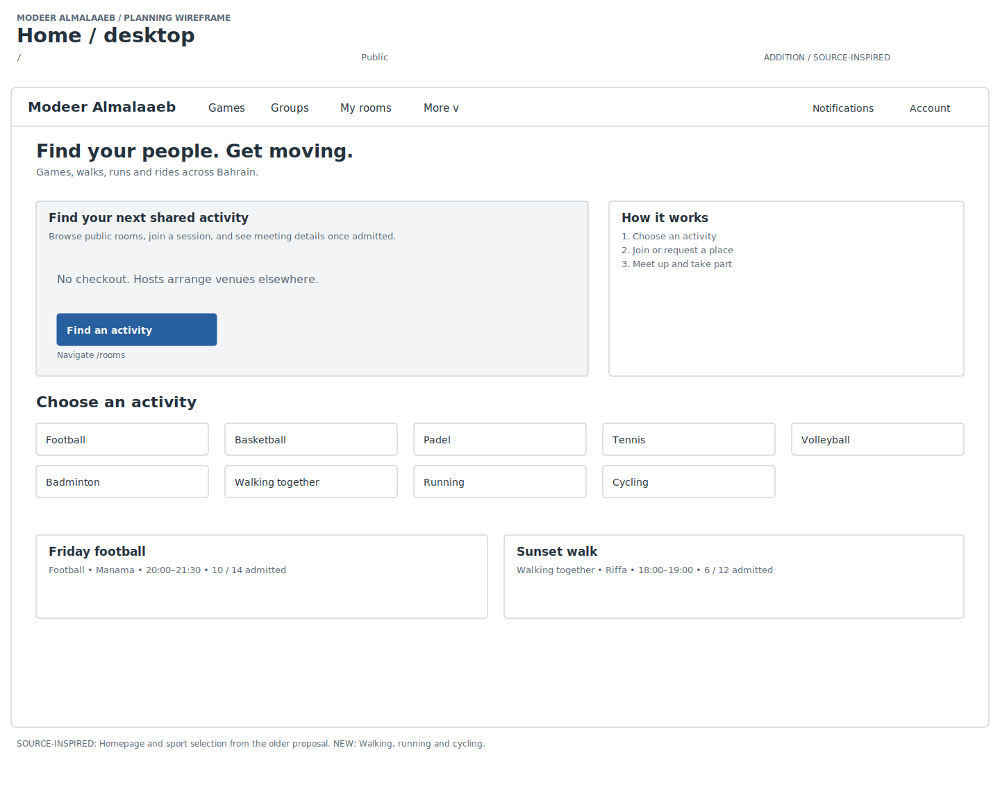
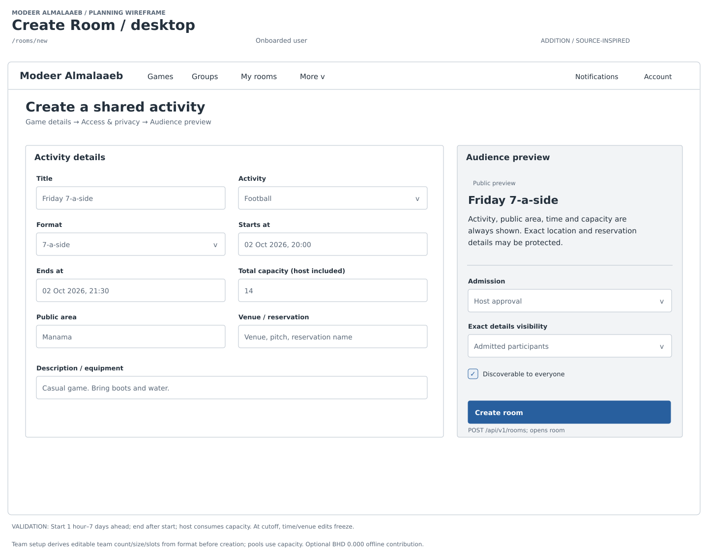
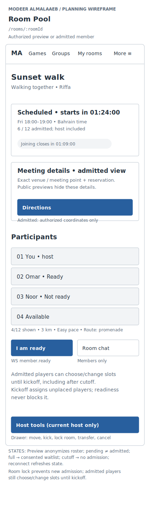

# Modeer Almalaaeb

Modeer El Malaaeb is a team-built community platform for people in Bahrain to discover and organize sports and outdoor activities, coordinate participants, and keep in touch through rooms, groups and messaging.

- [Live application](https://modeer-almalaaeb-frontend.vercel.app/)
- [API documentation](https://modeer-almalaaeb-backend.onrender.com/docs)
- [Backend repository](https://github.com/hassanelmaayati/modeer-almalaaeb-backend) · [Frontend repository](https://github.com/hassanelmaayati/modeer-almalaaeb-frontend)

## Team

Built collaboratively by [Ahmed Tarek](https://github.com/ctarek2015-wq), [Hassan Elmaayati](https://github.com/hassanelmaayati) and [Fatima Hubail](https://github.com/FatimaHubail). The Git history records each teammate's contributions across the application.

## Backend architecture

- FastAPI exposes REST endpoints under `/api/v1`; JWT bearer authentication protects account and participation actions. SQLAlchemy models and Alembic migrations target PostgreSQL with PostGIS for venue geometry.
- The signed-in client requests a single-use, 30-second ticket with `POST /api/v1/socket-ticket`, then opens `/api/v1/ws?ticket=...`. The server validates the JWT, checks browser origins and sends scoped room, message and notification events. Clients use REST for writes; authenticated sockets accept heartbeat pings.
- `/api/v1/ws/lobby` is the public discovery channel. It supports district subscriptions and heartbeat pings without requiring an account.
- Socket hubs and tickets live in process memory. Room lifecycle, host-presence and notification-retention tasks run inside FastAPI's lifespan when `LIFECYCLE_WORKER` is enabled. There is no Redis service or separate worker service in the current deployment; use one backend instance with one Uvicorn worker.

## Deployment

In Render, connect this repository with **New → Blueprint**. `render.yaml`
builds the Dockerfile on the Free plan in Frankfurt and releases commits to
`main` after required checks pass (`autoDeployTrigger: checksPass`). Keep the Docker command unchanged: it binds Render's `PORT` and starts
`main:app` with one worker. Use one backend instance for the in-memory socket hubs.

Supply `DATABASE_URL` (Supabase session pooler, port 5432, `sslmode=require`),
a stable private `JWT_SECRET`, and `CORS_ORIGINS` (the exact Vercel frontend
origin, without a path or trailing slash). `.env.example` documents these
settings. `LIFECYCLE_WORKER` is enabled by the Blueprint; Google sign-in is
optional and requires matching backend and frontend client IDs.
`HOST_AWAY_GRACE_SECONDS` (default 18000, five hours) is how long a started
room's host may stay offline before a connected player takes over.

The app refuses to start if `DATABASE_URL` or `JWT_SECRET` is missing, and warns
if `JWT_SECRET` is shorter than 32 characters. `/health` never touches the
database; `/health/ready` pings it (200 or 503).

Use the already initialized database. Startup does not migrate or import data.
Do not run `seed.py`, reset commands, or empty-database initialization against
an existing project. Apply new Alembic migrations separately after a backup with
`DATABASE_URL=... pipenv run alembic upgrade head`; run
`python -m scripts.import_sports` separately for deliberate catalogue updates.
Check `/health`, `/health/ready` and `/api/v1/sports` after deployment.

## Local database setup

Use Python 3.14 and Pipenv. Install PostgreSQL with PostGIS, create an empty database, copy `.env.example` to `.env` and set its `DATABASE_URL`, `JWT_SECRET` and local `CORS_ORIGINS` (for example, `http://localhost:5173`). Also export the same database URL in your shell: the initialization command requires an explicit `--database-url` and does not read `.env` itself. Then:

```bash
PIPENV_DONT_LOAD_ENV=1 pipenv sync --dev
pipenv run python -m migrations.initialize --database-url "$DATABASE_URL"  # schema + PostGIS
pipenv run python -m scripts.import_sports                                 # sports catalogue
pipenv run python seed.py                                                  # optional demo data
pipenv run uvicorn main:app --reload --host 127.0.0.1 --port 8000
```

`migrations.initialize` only accepts an empty schema (`--reset-existing` drops the
app tables first). `seed.py` imports the sports, then adds demo users, groups, cups
and rooms only when there are no users yet; it exits with status 1 on any failure.
Demo accounts are `user1@example.com` to `user4@example.com` with password `password123`.

## Testing and CI

```bash
PIPENV_DONT_LOAD_ENV=1 pipenv run python -m tests.run_offline --check
PIPENV_DONT_LOAD_ENV=1 pipenv run python -m tests.run_offline
```

The offline runner creates isolated PostgreSQL/PostGIS fixtures; it does not use the deployed database. PostgreSQL binaries must be installed and discoverable; set `MODEER_TEST_PG_BIN` to their directory when needed. Coverage and results are written to `tests/artifacts/`.

[GitHub Actions](.github/workflows/ci.yml) checks the gate policy, runs the offline tests with coverage, and builds and smoke-tests the production Docker container. The final `Backend CI` job requires every mandatory job to succeed before a release. Tests cover authentication, migrations, room admission and privacy, invitations, messages, notifications, ratings, cups, lifecycle and realtime limits/regressions.

## Project idea

A community website for people in Bahrain to organize activities, make friends, build groups and chat.

Activities (seeded catalogue): football, basketball, padel, swimming, **walking together, running and cycling**, handball, billiards and kayak. Outings use participant lists with optional distance, pace and route notes.

**Scope:** Nine tables: users, sports, rooms, memberships, messages, groups, cups, notifications and player ratings. [Implementation phases](plan.md).

Rooms must start between 1 hour and **14 days** from now. Times are stored in UTC and every response carries UTC timestamps (`+00:00`); showing Bahrain time is the frontend's job.

**Status:** Backend implemented and deployed; English-first desktop/mobile website. **Stack:** React/Vite (JavaScript/JSX), FastAPI, SQLAlchemy/Alembic, PostgreSQL with PostGIS, and WebSockets. Realtime hubs live in memory and the lifecycle worker runs inside the app process, so the backend runs as one instance with one worker.

Original project idea:

https://docs.google.com/document/d/146Ux37oZdEJnZHlKk3vzWZATzfPnYqUf0dR-ri5tRlU/edit?usp=sharing

## Repository links

- [Backend](https://github.com/hassanelmaayati/modeer-almalaaeb-backend)
- [Frontend](https://github.com/hassanelmaayati/modeer-almalaaeb-frontend)

## User stories

- As a visitor, I want to browse activities and rooms so I can find a suitable game or outing.
- As a player, I want an account and profile so others can recognize me.
- As a host, I want to schedule rooms and approve players so I can organize my activity.
- As an admitted player, I want a slot, readiness and room chat so we can coordinate.
- As a completion host, I want to record attendance and rate attended players so history reflects participation.
- As a player, I want accepted friendships and direct messages so I can coordinate privately.
- As a group owner/member, I want invitations and reusable groups so we can meet again.
- As a captain/organizer, I want cups with accepted rosters, knockout brackets or races so teams can compete.

## Wireframes


Main planning screens, organized by journey.

### Discover

**Home**



**Browse and filter rooms**


### Create and join

**Create and open a scheduled activity**



**Admitted player: choose a slot and coordinate**


### Walk, run or cycle

**Admitted player: mobile roster and meeting details**



### After the activity

**Completion host: attendance, ratings and group invitations**


Original wireframes; the new designs add mobile layouts and missing screens:

https://excalidraw.com/#json=mm8VWN_xrBNjyhHDay83Q,RyXy2F4vY2rYgb8-3t7_Xw

## ERDs

| Model | Stores |
| --- | --- |
| User | Accounts, profiles, home district and optional Google link (no roles); names are unique ignoring case |
| Sport | Activities and format presets; each sport's cup format comes from the server |
| Room | Schedule, privacy, admission policy, capacity, slot layout, venue point (PostGIS), cancellation and host hand-over state |
| Membership | Room/group members, friend connections and cup rosters |
| Message | Room chat, group chat, direct messages and system notices; senders can edit or soft-delete their own |
| Group | Social groups and persistent teams |
| Cup | Entries, knockout bracket or race results |
| Notification | Per-user notices and read state; read ones expire after 30 days and all after 90 |
| Player rating | A final 1–5 star rating from one player to another for one completed room |

Membership has no `kind` column: the row type follows from which target is set
(`room_id`, `group_id`, `cup_id` with `group_id`, or `other_user_id` for friends).
Friend rows carry one block flag per side (`user_blocked_other`, `other_blocked_user`). Room memberships record when a player was admitted (`accepted_at`). Room slots (`{"slots": [...]}` or `{"teams": [...]}`) and cup
entries/fixtures are JSON validated by the server.


[Editable ERD](assets/diagrams/erd.svg) (the diagram predates notifications, player ratings, the room venue, cancellation and host fields, message edit/delete times and `memberships.accepted_at`)

## Routes/endpoints

Each model shares a small set of pages and scoped endpoints. Use `/api/v1` before the API paths shown below. Frontend paths use `:roomId`; FastAPI paths use `{room_id}`.

| Model / feature | Main frontend routes | Main API endpoints |
| --- | --- | --- |
| User | `/sign-in`, `/sign-up`, `/users/:userId`, `/settings` | `POST /auth/signup`, `/auth/login`, `/auth/logout`<br>`POST /auth/google`, `/auth/google/link`<br>`GET /users?limit=&offset=` or `?ids=1,2,3`, `GET /users/{user_id}`, `GET /users/{user_id}/rating`<br>`GET/PUT /users/me` |
| Sport | `/`, `/sports` | `GET /sports`, `GET /sports/{sport_id}` |
| Room | `/`, `/rooms/new`, `/rooms/:roomId`, `/rooms/:roomId/edit`, `/my-rooms`, `/joined-rooms` | `GET /rooms?limit=&offset=&group_id=&near_lat=&near_lng=&radius_km=`, `POST /rooms`<br>`GET /rooms/mine`, `GET /rooms/joined`<br>`GET/PUT /rooms/{room_id}`<br>`POST /rooms/{room_id}/cancel`, `POST /rooms/{room_id}/transfer-host` |
| Membership | Room/after-game pages, `/friends`, group/cup pages | `GET/POST /rooms/{room_id}/members`, `PATCH /rooms/{room_id}/members/{user_id}`, `DELETE /rooms/{room_id}/members/me`<br>`GET/POST /friends`, `PATCH /friends/{user_id}`<br>`GET/POST /groups/{group_id}/members`, `PATCH /groups/{group_id}/members/{user_id}`<br>`GET/POST /cups/{cup_id}/roster`, `PATCH /cups/{cup_id}/roster/{user_id}` |
| Message | Room chat, `/messages`, `/messages/:type/:id` | `GET/POST /messages`, `PATCH/DELETE /messages/{message_id}`, `GET /messages/conversations` |
| Group | Dialogs on `/groups` | `GET /groups?limit=&offset=`, `POST /groups`<br>`GET /groups/mine`<br>`GET/PUT /groups/{group_id}` |
| Cup | `/cups`, `/cups/new`, `/cups/:cupId` | `GET /cups?status=&limit=&offset=`, `POST /cups`<br>`GET/PATCH/DELETE /cups/{cup_id}`<br>`POST /cups/{cup_id}/entries`, `PUT /cups/{cup_id}/entries/{group_id}` |
| Notification | Header bell and `/notifications` | `GET /notifications`, `PATCH /notifications`, `PATCH /notifications/{notification_id}` |
| Player rating | After-game page, profiles | `POST /rooms/{room_id}/ratings`, `GET /rooms/{room_id}/ratings/mine`<br>`GET /users/{user_id}/rating` (public) |
| Realtime | Shared WebSocket service | `POST /socket-ticket`, then `WS /ws?ticket=`; public `WS /ws/lobby` |

### Behaviour notes

- **Lists:** `GET /rooms`, `/groups`, `/cups` and `/users` page with `limit` (default 50, max 100) and `offset`, return plain lists and report the total in the `X-Total-Count` header.
- **Errors:** cup, entry and room writes send the `revision` they last read; a stale one returns 409. Invalid state changes return 409; invalid input returns 400 or 422. Login and signup are rate limited (429 with `Retry-After`).
- **Rooms:** public rooms are listed until 15 minutes before the start, when joining closes and schedule/venue/capacity freeze. Private rooms, and group-only rooms for people outside the group, answer 404 exactly like a missing room on every route. Group members can see, list (`?group_id=`) and join their group's rooms.
- **Joining:** with `admission_policy: "approval"` a request waits for the host; with `"open"` it is accepted at once when a place is free. Invitations always wait for the invitee. Positions must be a slot from the room's `slot_layout` (numbered places 1..capacity when it has none).
- **Distance search:** `?near_lat=&near_lng=&radius_km=` (1–50) sorts rooms by distance and adds `km_away` in whole kilometres. Distances are measured to a coarse area point (about 2 km), never the private venue pin.
- **Ratings:** players rate each other 1–5 stars once per room after it completes (host and accepted members take part, no-shows do not); ratings are final and only the rater can list theirs. The host rates through attendance, once per present accepted player, after completion. A profile average counts both kinds, and the host rating is only visible to the host.
- **Host hand-over:** the host can transfer a room to an accepted player. If a started room's host has no realtime connection for the grace period, the longest-admitted connected player takes over (notices, a chat message and the `room.host_changed` event follow). The old host stays as a player.
- **Messages:** senders can edit or delete their own messages while they could still send in that chat; a deleted message keeps its row, its text is erased and responses show `deleted: true`. Edits and deletes are pushed as `message.updated` and `message.deleted`.
- **Realtime:** WebSockets deliver room, message and notification updates; hubs live in memory, so run one instance with one worker.

[Route map](assets/diagrams/endpoints.svg)

## Component hierarchy

Shared account/session helpers and the WebSocket service support room pages, friends, groups, messaging, cups and notifications. The diagram is a planning overview; the frontend source describes the current component structure.


[Editable hierarchy](assets/diagrams/component-hierarchy.svg)

## Current limits

The application is English-first. Automatic slot assignment, waiting lists, calendar export, email/WhatsApp notices, Arabic, browser push and league/group-stage cups are not implemented. External sports news and administrative user roles are outside the current build. Clients refetch REST data after reconnecting; socket events are not a durable event log. See [the implementation plan](plan.md) for the current rules and remaining ideas.
